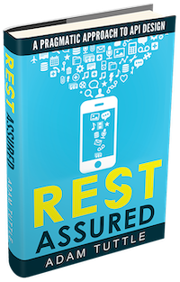

<p class="hero-badges">
  <a class="badge" href="https://github.com/atuttle/Taffy"><span>★</span> GitHub</a>
  <a class="badge" href="https://github.com/atuttle/Taffy/releases"><span>⬇</span> Releases</a>
  <a class="badge" href="https://cfml-slack.herokuapp.com/"><span>💬</span> #taffy on CFML Slack</a>
  <a class="badge" href="https://github.com/atuttle/Taffy/blob/master/LICENSE"><span>⚖</span> Apache-2.0</a>
</p>

# Write REST APIs in CFML — without the boilerplate.

**Taffy** is a full-featured REST framework for ColdFusion and Lucee. Drop a
CFC into your `/resources/` folder, add a URI annotation, and you have an API.
Content negotiation, caching hooks, CORS, JSONP, an interactive dashboard,
OpenAPI JSON, and custom serializers — all included.

<p class="cta-row">
  <a class="btn btn-primary" href="https://github.com/atuttle/Taffy/archive/v4.0.0.zip">Download v4.0.0</a>
  <a class="btn btn-secondary" href="#/?id=quickstart-your-first-api">Quickstart &rarr;</a>
  <a class="btn btn-secondary" href="#/4.0.0">Read the Docs</a>
</p>

## Why Taffy?

<ul class="feature-grid">
  <li>
    <span class="feature-title"><span class="feature-icon">⚡</span>One-file APIs</span>
    <span class="feature-body">A working API fits in a tweet. Seriously — inheritance and convention do the heavy lifting.</span>
  </li>
  <li>
    <span class="feature-title"><span class="feature-icon">🧭</span>Convention over config</span>
    <span class="feature-body">URI lives on the CFC. HTTP verbs map to CFC methods. That's the contract.</span>
  </li>
  <li>
    <span class="feature-title"><span class="feature-icon">🎛</span>Built-in dashboard</span>
    <span class="feature-body">Interactive API explorer at your index.cfm. Try every endpoint from a browser without writing a client.</span>
  </li>
  <li>
    <span class="feature-title"><span class="feature-icon">🧬</span>Content negotiation</span>
    <span class="feature-body">JSON, XML, JSONP, custom serializers — chosen by <code>Accept</code> header or extension. You pick the defaults.</span>
  </li>
  <li>
    <span class="feature-title"><span class="feature-icon">📘</span>OpenAPI out of the box</span>
    <span class="feature-body">Auto-generated OpenAPI/Swagger JSON for every route, new in v4. Point your favorite tooling at it and go.</span>
  </li>
  <li>
    <span class="feature-title"><span class="feature-icon">🧱</span>Pluggable everything</span>
    <span class="feature-body">Bring your own bean factory, serializer, status reporter, or caching strategy. The hooks are there.</span>
  </li>
</ul>

## Quickstart: Your First API

Three files. That's the whole API.

**Application.cfc**

```cfscript
component extends="taffy.core.api" {}
```

**index.cfm**

```
<!-- intentionally empty -->
```

**/resources/hello.cfc**

```cfscript
component extends="taffy.core.resource" taffy_uri="/hello" {

	function get(){
		return rep( [ "hello", "world" ] );
	}

}
```

Point a browser at `index.cfm` and you get the Taffy dashboard. Hit
`/hello` and you get JSON. Add a `post()` method — that's your POST handler.
Add `taffy_uri="/hello/{name}"` — now `name` is an argument.

[Read the full Getting Started guide &rarr;](https://github.com/atuttle/Taffy/wiki/Getting-Started)

## Current Release

> **Taffy 4.0.0** is the latest stable release.
> [Release notes](https://github.com/atuttle/Taffy/releases/tag/v4.0.0) ·
> [Download](https://github.com/atuttle/Taffy/archive/v4.0.0.zip) ·
> [Docs](4.0.0.md)

## All Versions

Taffy keeps every version's docs online forever — because nobody has time to
keep every framework and every dependency up to date. If you're still on an
older version, the docs that shipped with it still work.

<!--new_docs_links_here-->

### Taffy 4.x

<ul class="version-grid">
  <li class="current"><a href="#/4.0.0">v4.0.0</a></li>
</ul>

### Taffy 3.x

<ul class="version-grid">
  <li><a href="#/3.7.1">v3.7.1</a></li>
  <li><a href="#/3.7.0">v3.7.0</a></li>
  <li><a href="#/3.6.0">v3.6.0</a></li>
  <li><a href="#/3.5.0">v3.5.0</a></li>
  <li><a href="#/3.4.0">v3.4.0</a></li>
  <li><a href="#/3.3.0">v3.3.0</a></li>
  <li><a href="#/3.2.0">v3.2.0</a></li>
  <li><a href="#/3.1.0">v3.1.0</a></li>
  <li><a href="#/3.0.0">v3.0.0</a></li>
</ul>

### Taffy 2.x

<ul class="version-grid">
  <li><a href="#/2.2.4">v2.2.4</a></li>
  <li><a href="#/2.2.3">v2.2.3</a></li>
  <li><a href="#/2.2.0">v2.2.0</a></li>
  <li><a href="#/2.1.0">v2.1.0</a></li>
  <li><a href="#/2.0.1">v2.0.1</a></li>
  <li><a href="#/2.0.0">v2.0.0</a></li>
</ul>

## Community

- 💬 Join **#taffy** on the [CFML Slack](https://cfml-slack.herokuapp.com/)
- 🐛 [Report issues on GitHub](https://github.com/atuttle/Taffy/issues)
- 🙋 [Contribute](https://github.com/atuttle/Taffy/blob/master/CONTRIBUTING.md)
- 📜 [Changelog](https://github.com/atuttle/Taffy/releases)

## Other Resources

<div class="book-promo">
  <a href="http://www.restassuredbook.com"></a>
  <div class="book-body">
    <h4>Need to level up on REST fundamentals?</h4>
    <p>Taffy's author wrote a book on API design. <em>REST Assured — A Pragmatic Approach to API Design</em> covers the parts every framework leaves out.</p>
    <p><a href="http://www.restassuredbook.com">Get the book &rarr;</a></p>
  </div>
</div>
